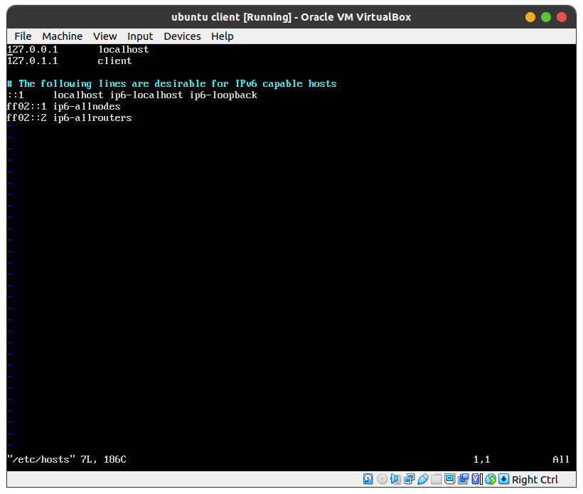

#  Step One

1st I created a virtual machine with Ubuntu Server 16.04 installed. I titled this Ubuntu base, and using the terminal installed a couple packages.

``` 
sudo apt install openssh-server man manpages manpages-dev nano
```

I then Cloned this virtual machine three times titling them client, router, and server. In the clone process I re-initialized the MAC address for each. 


# Step Two

I then changed the network settings for the Client virtual box adding another network adapter changing it to Internal Network and naming it neta 


I did the same for the two virtual machines, for the router network settings I added two network adapters named neta and netb. For the Server network settings I added another network adapter named netb.


# Step 3 

Upon completing step 1 and 2 I opened all three virtual machines and logged in. I then used the following commands to change the host name of the three virtual machines. (I did this in each machine)

```
sudo hostnamectl set-hostname <name>

sudo vi /etc/hosts
```


# Step 4

I then needed to configure the interfaces of all three virtual machines, I did this using the following command in all three interfaces 

```
sudo vi /etc/network/interfaces
```
In the client VM i added the following

```
# The internal interface on neta
auto enp0s8
iface enp0s8 inet static
    address 192.168.1.11
    netmask 255.255.255.0
    network 192.168.1.0
    broadcast 192.168.1.255
    post-up route add -net 192.168.0.0 netmask 255.255.0.0 gw 192.168.1.1 dev enp0s8
    pre-down route del -net 192.168.0.0 netmask 255.255.0.0 gw 192.168.1.1 dev enp0s8
```


In the Router VM
```
# The internal interface on neta
auto enp0s8
iface enp0s8 inet static
    address 192.168.1.1
    netmask 255.255.255.0
    network 192.168.1.0
    broadcast 192.168.1.255

# The internal interface on netb
auto enp0s9
iface enp0s9 inet static
    address 192.168.2.2
    netmask 255.255.255.0
    network 192.168.2.0
    broadcast 192.168.2.255
```


Lastly In the server VM
```
# The internal interface on netb
auto enp0s8
iface enp0s8 inet static
    address 192.168.2.22
    netmask 255.255.255.0
    network 192.168.2.0
    broadcast 192.168.2.255
    post-up route add -net 192.168.0.0 netmask 255.255.0.0 gw 192.168.2.2 dev enp0s8
    pre-down route del -net 192.168.0.0 netmask 255.255.0.0 gw 192.168.2.2 dev enp0s8
```


# Step 5

Lastly I enabled forwarding on the router VM by uncommenting the line referring to ip_forward and rebooted the router.


### The following screenshot is me pinging from the client, the router and server. ### 


The final screenshot is showing the VM still has access to the real internet by pinging google.com 


### Jorge Sanchez ###
### CIS-106 ###
### 12/14/2021 ###

