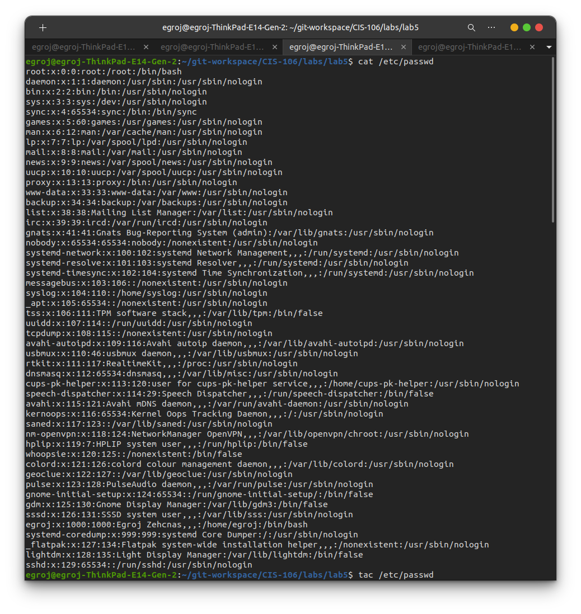
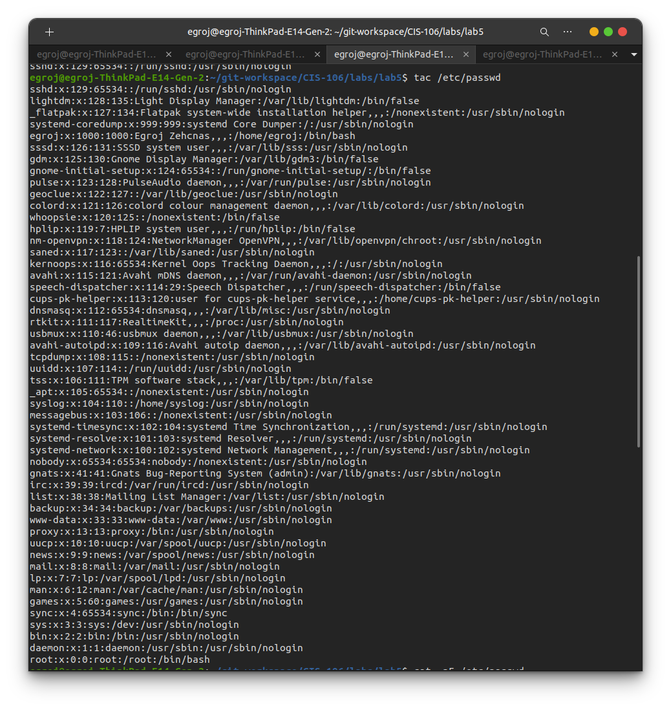
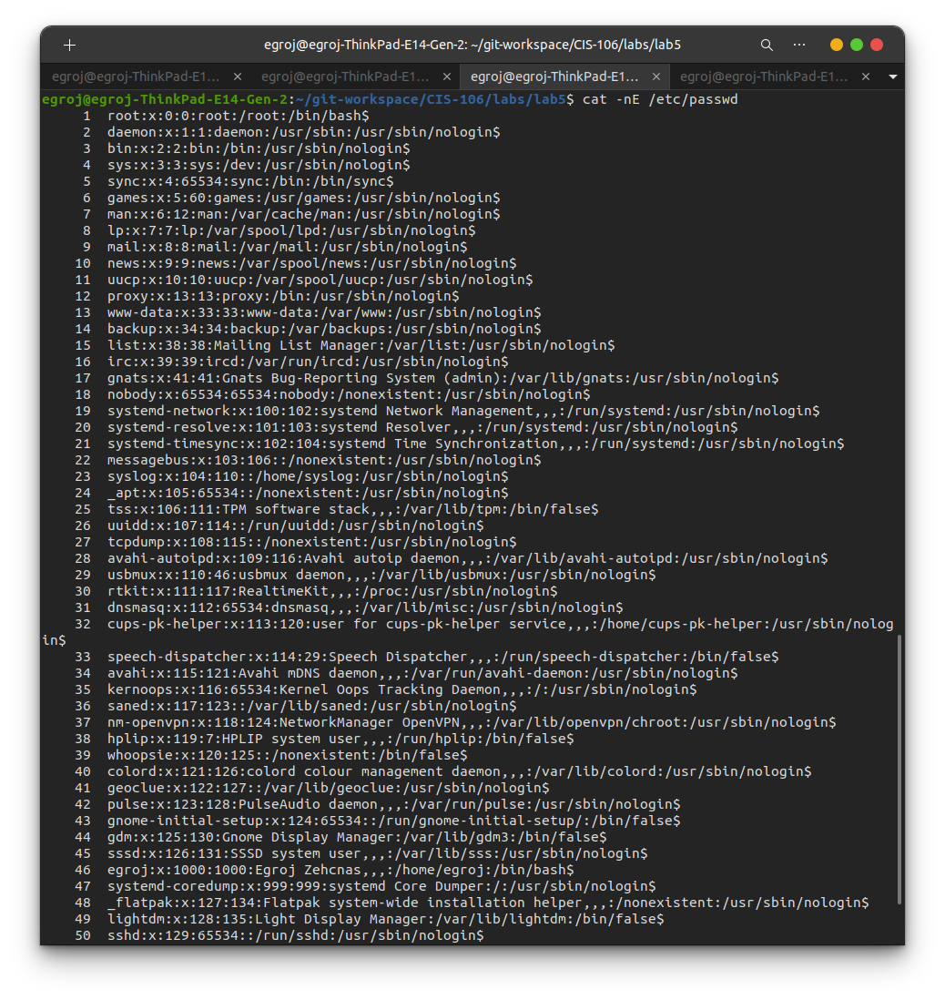
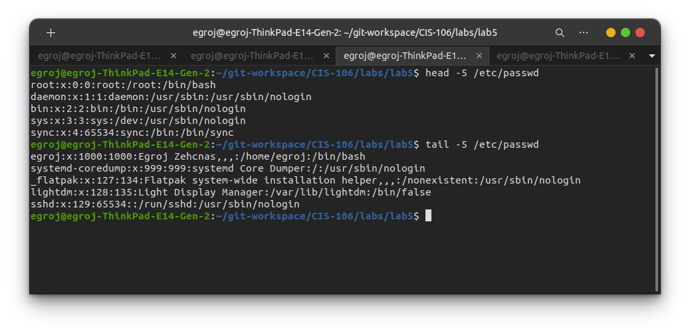
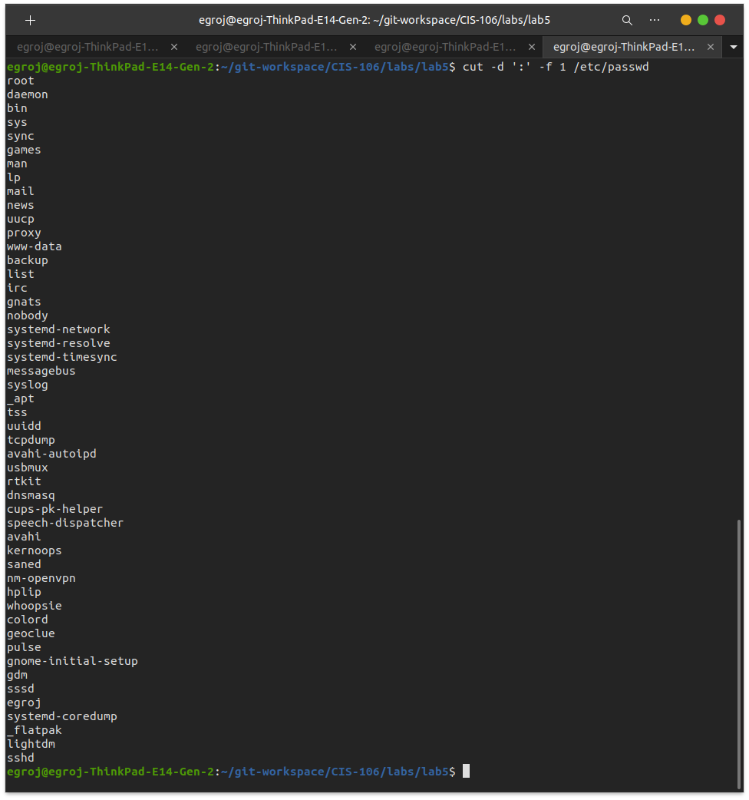
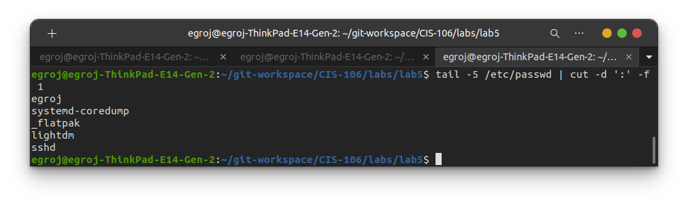
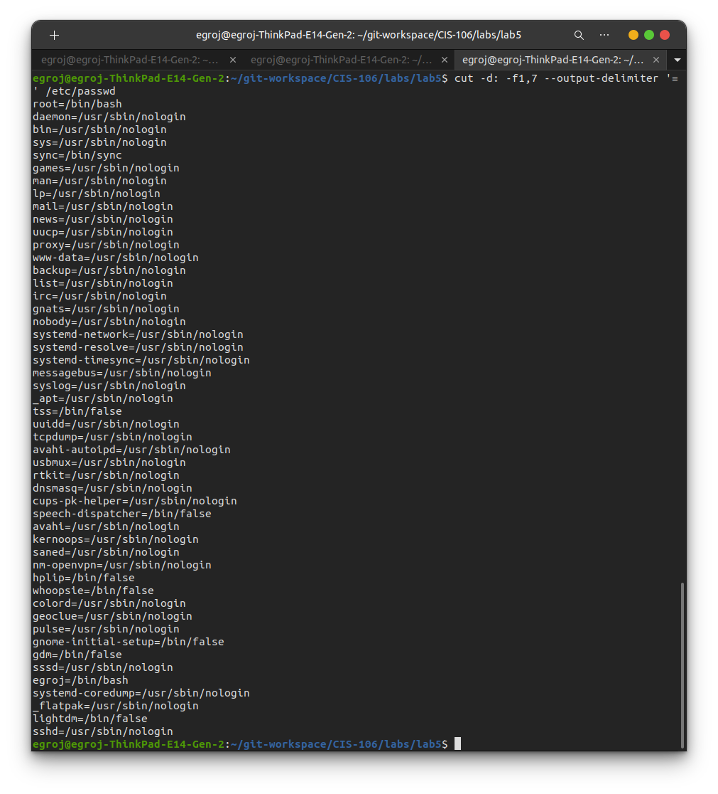
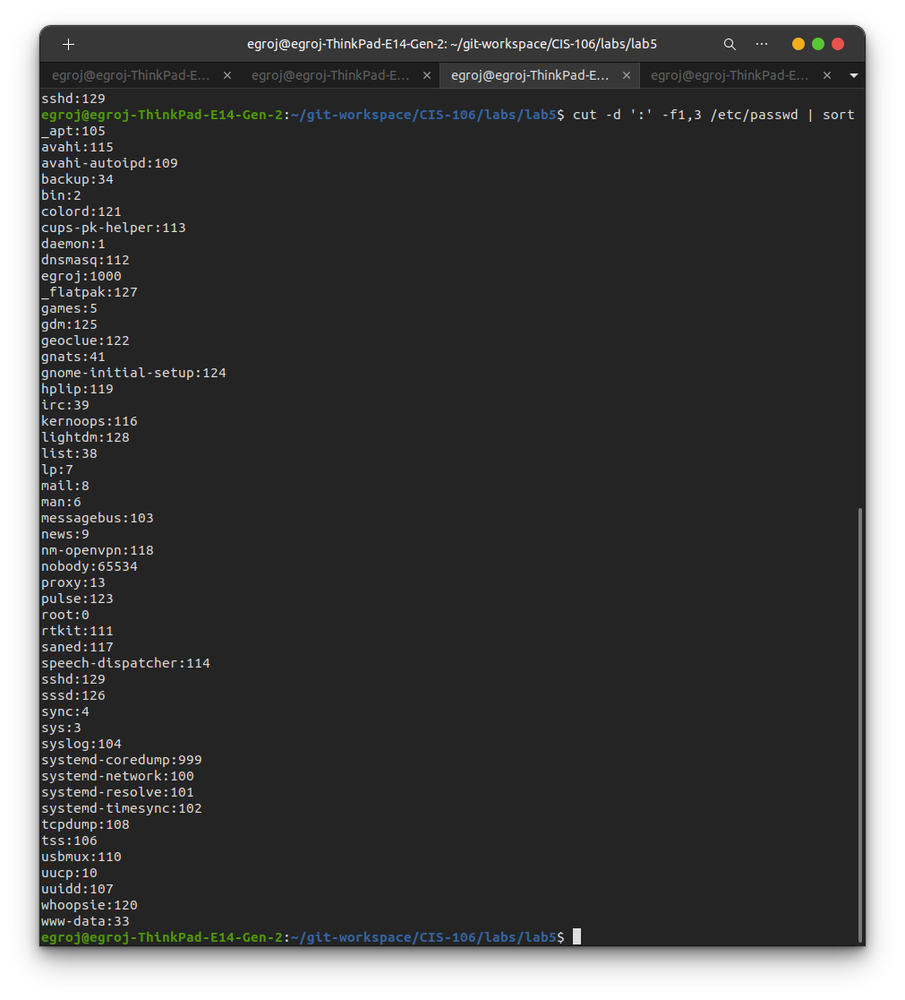
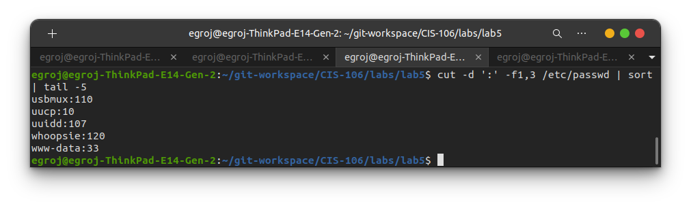
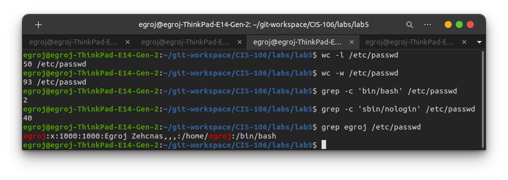

# Lab 5
## Question 1
### Answer 1

### Answer 2

### Answer 3

### Answer 4-5

## Question 2
### Answer 1

### Answer 2

### Answer 3

### Answer 4

### Answer 5

## Question 3
1. 50 lines
2. 93 Words
3. 2 Users
4. 40 Users

